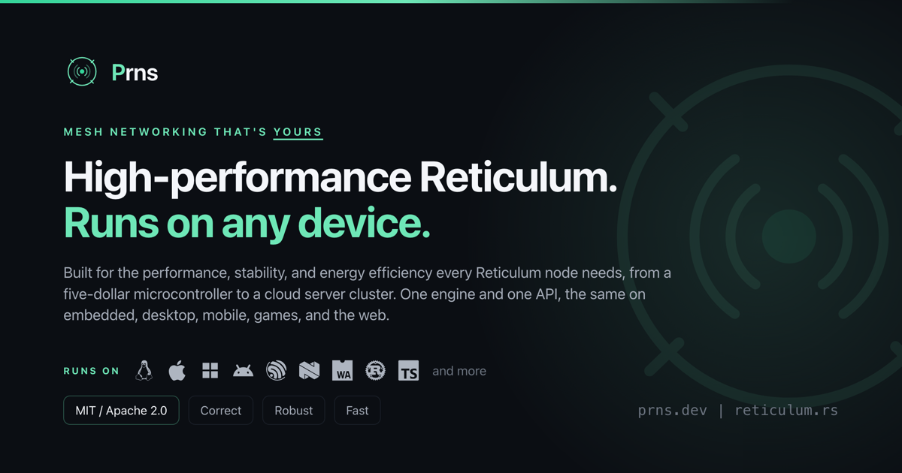

# Prns

> [!IMPORTANT]
> **YOU FOUND PRNS A DAY OR FEW EARLY.**
>
> We are completing final release validation, packaging, and documentation.
> The repository is public for early review, but this is not the announced
> release yet. Expect a little movement before the first public release.

<p align="center">
  <a href="https://prns.dev" target="_blank">
  
  </a>
</p>

[](https://github.com/KenAKAFrosty/Prns/actions/workflows/ci.yml)
[](#license)
[](#minimum-supported-rust-version)
[](#embedded-and-no_std)

Prns exists so one Reticulum engine and one application contract can run across
microcontrollers, browsers, mobile and desktop applications, daemons, and
servers. The engine stays native to each home: fixed-capacity firmware does not
pay for a heap, browser code cooperates with the event loop, and hosted
applications use native threads and operating-system interfaces.

The same design makes performance and correctness visible rather than
aspirational:

- native execution and bounded storage conserve CPU time, memory, and battery;
- interfaces can be attached, supervised, replaced, and removed while a node
  keeps running;
- compatibility claims come from measured Reticulum interoperability suites;
- release, benchmark, and verification evidence is public and reproducible.

First-class SDKs and bindings cover:

- Rust
- TypeScript and JavaScript (browser, Node.js, and Bun)
- Python
- .NET and C#
- Go
- Swift
- Kotlin, Java, and Android
- Julia
- C and C++

The repository contains the engine, every SDK, essential guides, tests,
benchmarks, release custody tools, and a locally runnable documentation site.
Packages are not assumed to exist in a registry until the corresponding guide
explicitly says they have been published.

To view the documentation website right away, visit
[prns.dev](https://prns.dev) or [reticulum.rs](https://reticulum.rs).

## Prerequisites

The common paths need Git, Rust 1.90 or newer, and Python 3.11 or newer. Check
your machine without installing anything:

```console
./tools/prns doctor getting-started
```

On Windows, use `tools\prns.cmd`. First-time dependency downloads may require
internet access, but the instructions and source material are all in this
repository.

## What do you want to do?

| Outcome | Start here |
| --- | --- |
| Learn the repository | [Getting started](docs/getting-started.md) |
| Browse runnable and checked examples | [Example catalog](docs/examples.md) |
| Integrate Prns into an application | [Application integration](docs/application-integration.md) |
| Run and inspect a node | [Prnsd (the daemon) guide](prnsd/README.md) |
| Build a Rust application | [Personal RNS guide](personal-rns/README.md) |
| Build an embedded node | [Embedded Prns guide](docs/embedded.md) |
| Develop or qualify a Hopspot board | [Personal Hopspot guide](personal-hopspot/README.md) |
| Understand the signed Hopspot flasher release-candidate route | [Hopspot release process](https://github.com/KenAKAFrosty/Prns/blob/main/release/flash/README.md) |
| Test a change | [Testing guide](docs/testing.md) |
| Measure performance | [Benchmark guide](benchmarks/README.md) |
| Build the local website | [Website README](docs/website/README.md) |
| Discover repository operations | [Repository tools](tools/README.md) |

## First commands

Run the Rust quickstart. It creates fresh identities, binds only to localhost,
observes a real Reticulum announce, and exits:

```console
cargo tools guide rust
```

Run the normal core test path:

```console
cargo test --locked
```

Serve the documentation site locally:

```console
cargo run -p docs
```

Enable the repository hooks once per clone:

```console
git config core.hooksPath .githooks
```

## Embedded and `no_std`

`prns-core` has two distinct embedded profiles: fixed-capacity,
allocator-free `no_std`, and growable `no_std + alloc`. The Embassy runtime and
interface implementations carry the same engine onto ESP32 and nRF52840
firmware targets. Follow the [board-backed embedded guide](docs/embedded.md) to
build a real XIAO ESP32-C6 node and trace the shared node recipe into its
hardware obligations.

## Minimum supported Rust version

The workspace's declared and CI-tested MSRV is Rust **1.90**. Development builds
use the stable channel configured in [rust-toolchain.toml](rust-toolchain.toml).

## Contributing

See [CONTRIBUTING.md](CONTRIBUTING.md) and the
[testing guide](docs/testing.md).

## Security

See [SECURITY.md](SECURITY.md) for how to report a vulnerability.

## License

Licensed under either of

- Apache License, Version 2.0 ([LICENSE-APACHE](LICENSE-APACHE))
- MIT license ([LICENSE-MIT](LICENSE-MIT))

at your option.

Unless you explicitly state otherwise, any contribution intentionally submitted
for inclusion in this project by you, as defined in the Apache-2.0 license,
shall be dual licensed as above, without any additional terms or conditions.
