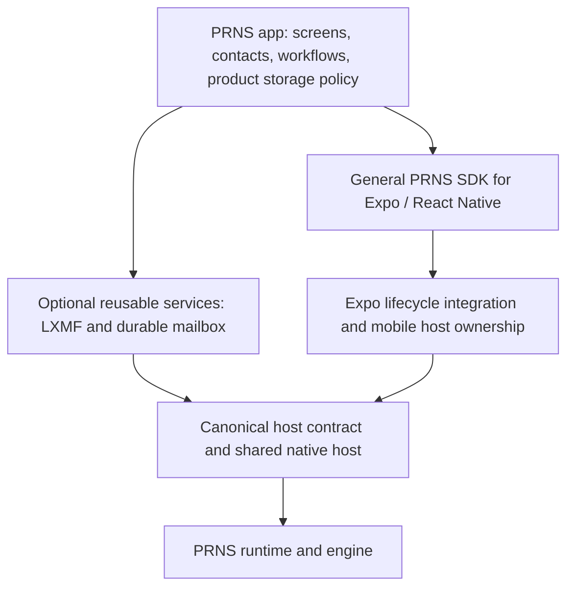

# General-purpose React Native PRNS SDK investigation

Status: historical architecture investigation; UniFFI/shared-host direction selected. Source audit of
`prns-app` at `e39eb2a1c6eff87875662a42c3ea85828a26b9b2`, 2026-09-22.
No production runtime changes or new platform qualification were performed.
The [implementation plan](react-native-sdk-implementation-plan.md) records the
deeper audit, concrete ownership decisions, ordered migration, removal targets,
acceptance gates and bounded desktop probe evidence. It supersedes the initial
sequence in this investigation.
Current code ownership and qualification are recorded in the
[implementation record](react-native-sdk-implementation.md); the findings below
describe the audited baseline.

Scope clarification: Expo is an accepted required dependency of the proposed
React Native SDK. General-purpose means reusable across Expo applications and
independent of the PRNS app's features and policy. Supporting React Native
without Expo is outside this investigation.

## Assessment

A general-purpose React Native SDK is a sensible missing layer. The existing
`@prns-internal/expo` package is an app integration: its public operations,
configuration, persistence, and process owner are coupled to the PRNS app. It
cannot become a general SDK merely by changing its name or generating more
bindings.

This is a package/API and host-composition boundary problem, not evidence that
the routing engine has been duplicated or polluted with app policy. The app
uses public Rust PRNS APIs, the core does not depend on `applications/`, and the
app reuses the canonical `HostSnapshot` and its schema. Those boundaries remain
valuable.

The original plan explicitly chose this direct application composition and
deferred reusable language SDKs. See the historical
[architecture](../../scratch/prns-app/architecture.md) and
[platform SDK inventory](../../scratch/prns-app/sdk-and-platforms.md). That was
a deliberate app-first scope. Once a reusable RN SDK is a deliverable, continuing
to extend the app bridge as though it were that SDK would compound architectural
debt. The corrective action is to establish the missing public host adapter and
move proven reusable mechanisms below the application.

## What the source establishes

| Finding | Evidence | Consequence |
| --- | --- | --- |
| The RN entry point is a product API. | [SDK exports](../prns/platform/src/index.ts) construct a singleton `developmentRuntime` and export contacts, LXMF mailbox operations, remote management, and development reset. | A generic consumer cannot select only the normal host API. |
| Host creation selects app services and policy. | [Native composition](../prns/native-composition/src/lifecycle.rs) constructs `PrnsNodeRecipe`, enables RemoteControl, registers the LXMF destination and callbacks, and owns app storage. | The composition bypasses `NativeHost`; general host improvements do not automatically reach this owner. |
| Startup configuration is app-specific. | [Contract](../prns/native-composition/src/contract.rs) exposes `DevelopmentNodeStartInput` with a development TCP target; [storage](../prns/native-composition/src/node.rs) requires a `prns/development` suffix. | This is not a projection of general `HostConfig`, destinations, roles, interfaces, and limits. |
| Mobile infrastructure and product ownership are interwoven. | [Android service](../prns/platform/android/src/main/java/rs/reticulum/prns/app/expo/PrnsRuntimeService.kt) invokes generated app start/stop/reset; [Android runtime](../prns/platform/android/src/main/java/rs/reticulum/prns/app/expo/PrnsAndroidRuntime.kt) fixes the storage root. | Permissions, Bluetooth ownership, and lifecycle work need separation from product defaults. |
| Canonical inspection data is already reused. | [LocalHostState](../prns/native-composition/src/contract.rs) contains `prns_host::HostSnapshot`; the baseline app's `tools/generated-bindings/host_contract.py` (since removed) resolves the locked core schema. | Preserve this reuse rather than inventing an RN snapshot vocabulary. |
| The shared host already supplies general operations. | [HostCommand](../../prns-host/core/src/command.rs), [HostConfig](../../prns-host/core/src/config.rs), and the [host architecture](../../prns-host/README.md). | RN should project the same contract as other hosted targets. |
| Some required capabilities are missing from that contract. | Shared [native host](../../prns-host/impls/native/src/lib.rs) constructs its node with `RemoteControlService::Unavailable`; the canonical commands/events do not project pairing and authorized management. | App migration requires targeted core-host additions, not just a different bridge. |

There are two binding systems today: canonical host-schema generation and
application UniFFI generation. Generated transport copies can be legitimate;
independently maintained meanings for the same host operation should not be.

## Proposed ownership



The service arrow denotes a dependency on public host APIs, not a second host
instance. A native service and the RN facade must address the same host session.
An app may retain Rust services and an app-specific bridge above this boundary;
building atop a public SDK does not require moving durable work into JavaScript.

| Layer | Owns | Excludes |
| --- | --- | --- |
| Shared PRNS host | Host configuration, commands, bounded events/resources, identity and destination primitives, persistence semantics, capabilities, and general RemoteControl operations when added. | Contacts, inbox policy, app screens, product reset, OS permission prompts. |
| Expo/RN adapter | Canonical TypeScript types, host/command/stream ownership, async scheduling, cancellation, exact integers, binary transfer, ABI checks, and Expo packaging. | App operation names, required LXMF service, app-owned singleton or storage path. |
| Mobile integration within the SDK | Expo lifecycle hooks, platform transport ownership, private storage location resolution, native startup/reattachment, restoration, foreground-service mechanics, and permission state. | Which services the product runs, permission explanation copy, automatic product onboarding or mailbox resets. |
| Optional service packages | LXMF wire behavior, messaging service, and a separately selectable durable mailbox. | Mandatory dependencies of every PRNS node or every RN consumer. |
| PRNS app | Contact aliases/pins, selected services, onboarding, screen projections, notification presentation, retry UX, and product storage/reset policy. | A second implementation of host commands and protocol semantics. |

The existing LXMF service is already a useful starting point:
[its manifest](../services/lxmf/Cargo.toml) separates Tokio and redb features,
and [DirectNetwork](../services/lxmf/src/direct.rs) abstracts several network
operations. Its current callbacks and local identity handling still depend on
lower-level Rust APIs, so this is not yet proof of portability across hosted
SDKs or browsers.

## Core additions supported by concrete needs

These are proposals for the hosted SDK boundary. They do not mean adding
React Native, UniFFI, a database, or mobile lifecycle code to `prns-core`.

1. **RemoteControl projection.** Expose typed pairing discovery/confirmation,
   approval/rejection, target/grant inspection, and authorized operations from
   the existing Rust implementation. Separate the protocol operations from app
   workflows such as “load the remote overview,” which currently combines
   multiple requests and presentation projections. Publish the same semantics
   for supported hosts, with explicit unsupported outcomes where needed.
2. **Authenticated announce observations and public identity lookup.** LXMF's
   [accepted-announce callback](../services/lxmf/src/direct.rs) uses verified
   identity association, bounded app data, observation time, and path-response
   status. It deliberately does not discover peers from diagnostics. Current
   [AnnounceHeard](../../prns-host/core/src/events.rs) is a diagnostic carrying
   fewer facts, and diagnostics may drop. Add a deliberate application-facing
   observation/query contract with explicit bounds and loss/recovery behavior.
   Destination public-key lookup is also needed: canonical
   [DestinationIdentitySnapshot](../../prns-host/core/src/inspection.rs) contains
   hashes only. The lower-level [N-API adapter](../../prns-napi/src/node.rs)
   already has additional identity lookup operations through the host's preview
   path; audit and promote suitable semantics instead of recreating them for RN.
3. **Native service access to a shared host.** Establish a small supported seam
   for a concrete LXMF service to issue commands and receive the events it
   requires on the same host. Specify service attachment, event ownership,
   shutdown/drain ordering, and failure propagation. Existing
   `preview_handle`/`on_preview_runtime` are evidence of demand, not a complete
   portable service API. Do not expose raw Rust pointers to JavaScript or add a
   speculative plugin/service registry.
4. **Mobile transport attachment and restoration hooks.** Generalize the native
   embedding mechanism where necessary. Core already represents automatic BLE,
   and the public Rust BLE interface already supports restoration preparation.
   The host projection does not express the app's preparation/ownership path.
   Restoration IDs, permissions, and platform managers belong in mobile
   integration; portable host configuration must not acquire app-specific OS
   settings.

Identity import, creation, destination setup, and persistence already have
substantial core support. First map existing operations and identify the exact
remaining need. Do not promote `inspectDevelopmentIdentity` or
`resetDevelopmentData` wholesale into the host contract.

For each addition, require a use case beyond the PRNS app, a language-neutral
meaning, explicit ownership/bounds, a compatibility decision, and conformance
on another applicable target. Cross-target design does not imply that every
device must implement every capability.

## RN implementation direction

The public Expo/RN API should follow the existing `personal-rns` configuration,
command/outcome, snapshot, event, and resource vocabulary. A dedicated RN
package/entry point can supply Expo-based native installation without making
browser and Node users install Expo or RN. Exact package names remain undecided. Avoid a third
public tagged-enum shape merely because UniFFI emits a different transport form.

The selected bridge is UniFFI/JSI directly over the shared Rust host, with Expo
integration. This choice is separate from the public semantic API.

Both routes need executable Rust/JavaScript marshalling. The core schema
generator produces TypeScript contracts and raw protocol declarations, not an
RN implementation of those declarations. Existing Node/N-API and browser/WASM
bridges target different execution environments; the Swift/Kotlin adapters
marshal native-language values rather than JavaScript values.

“Direct Rust” here means bypassing the existing `prns_host` C capsule, not
eliminating FFI. UniFFI itself generates a C-compatible ABI and value converters.
The current app already uses that generation path, but exports app operations
rather than the canonical host operations. The selected route is:

```text
JS <-> generated UniFFI/JSI bindings <-> Rust binding facade <-> shared Rust host
```

This path includes UniFFI's generated ABI. It does not call raw Rust types
directly from JavaScript or require implementing another host.
See the [existing TypeScript protocol generator](../../tools/repo/generate-host-contract.py),
[current app converters](../prns/native-composition/bindings/typescript/prns_app.ts),
and [UniFFI's lowering/lifting description](https://mozilla.github.io/uniffi-rs/next/internals/lifting_and_lowering.html).

| Candidate | Benefit | Work and uncertainty |
| --- | --- | --- |
| JSI/C++ over the canonical C capsule | Follows the existing native-binding guide, reuses host ownership/readiness, and avoids separately wrapping Swift and Kotlin. | Requires RN-facing generation/marshalling and a correct readiness/teardown adapter. |
| UniFFI/JSI directly over the shared Rust host | Reuses substantial existing generation, packaging, and teardown work; parallels the direct-host N-API route. | Requires schema-derived canonical bindings, host/command/resource handle support, event ownership, and reconciliation with the current C-first binding convention. Existing app function/record/future checks do not qualify these new lifetimes. |
| Expo wrapper over existing Swift/Kotlin SDKs | Reuses the public native adapters. | Adds two platform adaptation paths plus JS conversion; does not fill the missing host capabilities or solve shared native service ownership by itself. |

Use the canonical host contract and existing conformance journeys as the
baseline for either route. The C route reuses an established ABI, ownership,
and readiness implementation, but still needs new RN marshalling and scheduling
glue. The UniFFI route reuses an existing RN marshalling generator, but requires
a thin binding facade over the shared host and qualification of its handles,
streams, cancellation, and teardown. It also retains a separate generated ABI
and generator/runtime dependency. No performance advantage is established by
this audit.

Retain UniFFI and prove it over a bounded canonical host slice. Do not replace
the current generator merely to repair package boundaries. Document this
intentional architecture alongside the existing direct-host N-API adapter,
updating the C-first binding guide. The deeper audit found that queue, resource,
readiness and lifecycle machinery must first move from the C capsule into
shared Rust implementation code; otherwise the new wrapper would duplicate it.

Use Expo Modules and lifecycle integration as part of the SDK. Consumers may be
required to provide the corresponding Expo infrastructure. The RN adapter and
mobile integration above are responsibility boundaries and can ship together;
this proposal does not require separate Expo and non-Expo implementations.
See [Expo library integration](https://docs.expo.dev/modules/existing-library/)
and [installation in existing RN projects](https://docs.expo.dev/bare/installing-expo-modules/).

## Ownership that migration must preserve

- Define whether a host is owned by an explicit session or retained by a native
  platform owner. Releasing a JS view and stopping the host are distinct actions.
  Keep native startup before JavaScript and reattachment after reload available.
- Do not retain the app's process-global singleton as the general API. Use
  explicit host/session identity and exclusive ownership of persistent state.
  If the first mobile release supports one retained host, state that limit and
  reject a conflicting request; do not imply untested multi-host support.
- Preserve one native host and one authoritative storage owner. A new RN module
  and an old app bridge must never independently start hosts against the same
  identity/storage. Native services must share the authoritative instance.
- Define stream ownership during reattachment. Current host event lanes are
  single-consumer. An LXMF service and JavaScript cannot each claim the same
  stream and assume both receive every event. Any routing/fan-out must be
  explicit, bounded, and compatible with durable service operation while JS is
  absent; it must not turn diagnostics into a reliable application channel.
- Keep waits, storage I/O, and shutdown joins off the JS thread. Preserve exact
  integers, cancellation versus accepted-work distinctions, and draining of
  admitted durable work. Native resources must be released or deliberately
  retained when a React runtime is invalidated. This follows RN's documented
  [native module lifecycle](https://reactnative.dev/docs/the-new-architecture/native-modules-lifecycle).

## Proposed sequence and completion evidence

1. **Adopt the boundary and inventory.** Classify current app operations as
   canonical host, missing general host capability, optional service, platform
   mechanism, or product policy. Treat this document as the initial inventory;
   do not rename the existing app bridge as a public SDK.
2. **Prove the general host slice in an independent Expo sample.** Create/configure a
   host, attach TCP, announce/discover, establish a link, request/respond,
   transfer a bounded resource, inspect, stop, and restart. Reuse the repository's
   [persistent two-node conformance journey](../../prns-host/conformance/persistent-two-node-v1.json).
   The sample must not depend on the PRNS app, contacts, or LXMF. Include exact
   integer checks, error outcomes, cancellation, stream claims, and resource
   release. Use the chosen UniFFI route and the prerequisites in the detailed
   implementation plan.
3. **Qualify mobile ownership independently.** Exercise native startup, JS
   reload/invalidation and reattachment, Android service ownership, iOS
   restoration, permission/radio transitions, and explicit shutdown. Verify a
   single shared native image/host. Use physical devices for OS behavior;
   retain platform and build-specific evidence.
4. **Add missing host capabilities in focused core changes.** Start with the
   RemoteControl and authenticated observation/identity needs above. Generate
   the canonical projections and exercise another host/language. Separately
   prove that the native LXMF service can use the same host while JS is absent.
5. **Migrate the app to the qualified owner.** Move existing services onto that
   host and route general operations through the public RN API. Keep product
   projections and storage policy above it. Do not run the old and new owners
   concurrently for the same persistent identity. Remove redundant wrappers
   only after retained-data, messaging, pairing, stop/reset, and lifecycle
   journeys pass.
6. **Qualify distribution.** Test a clean external Expo consumer, native
   installation, platform assets and minimum versions, release builds, ABI
   compatibility, and package exports before calling this a public SDK.

The independent host sample is the first useful implementation milestone. A
full app migration should wait for the capability and ownership gaps to be
closed. No package publication or implementation is authorized by this proposal
alone.

## Follow-through

The [implementation plan](react-native-sdk-implementation-plan.md) now specifies
session ownership, reclaimable event lanes, a native LXMF consumer, generated
contract coverage and one-image composition. Concrete public host additions
still require schema/API review during implementation. Cooperative-host support
must be implemented or explicitly reported as unavailable per capability.
Those gates do not reopen the selected UniFFI direction or the core/app boundary.
